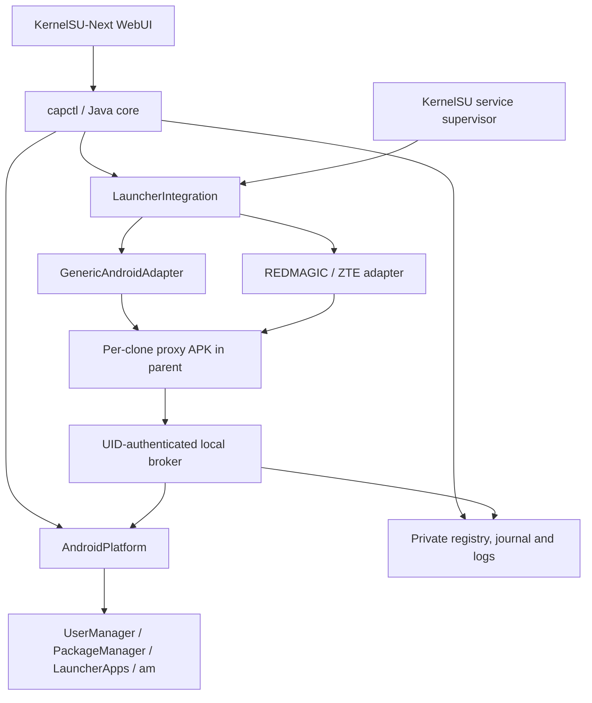

# Architecture

## Boundaries

POSIX shell scripts only bootstrap Java through app_process. The backend uses
Android's JSON, reflection for an isolated list of checked hidden framework
methods, and documented shell interfaces with fixed executable paths and argv
arrays. No eval, Binder transaction numbers, OEM settings, system APK edits or
secondary-user fallback. This avoids parsing user names/type/serials out of
vendor-specific `pm list users` output. `pm get-max-users` and clone-type dump
metadata have conservative, failure-reporting parsers.

WebUI does not parse Android system state. It sends an allowlisted operation and
validated package/user arguments to capctl. DOM strings use textContent; CSP
blocks remote scripts, network fetches and inline code. Updates are read in the
backend from a fixed HTTPS release URL. The optional Next icon API is presentation
only; package eligibility and ownership come from the backend.

## Registry and operations

Schema 1 contains `profiles`, `clones`, `pending`. A FileChannel lock serializes
CLI, WebUI, scheduled reconciliation, profile deletion and broker launches. The
kernel releases locks on process death. All registry commits validate JSON,
write/fsync a temporary file and atomically rename it; directory fsync is attempted
where available. A previous validated snapshot is retained. Invalid schemas or
corruption block operations, rather than resetting ownership.

Profile identity is `(userId, serialNumber, type, parentUserId, parentSerial)`.
Clone identity is `SHA256(packageName : parentSerial : targetSerial)`. Registry
records also contain source/target IDs, package label/version, operation ID,
install timestamp and certificate, and all launcher state/evidence. Before a
package mutation or launch, the actual profile and package identities are checked
again. Reinstallation/signature changes require inspection instead of implicit
adoption. App updates that retain the signing identity and original installation
time keep their mapping.

Creation and package installation have a durable intent journal before Android
mutation. Only verified resources enter the ownership registry. If a crash occurs
between a system commit and verification, the operation stays pending and blocks
new creations; it is not silently adopted. Failed profile initialization is
rolled back only for the newly returned, revalidated identity. Removal transitions
through `REMOVING`/`DELETING` and can be retried; ownership is retained on failure.

## Launcher states and fallback

`PENDING → INSTALLING_PROXY → PROBING_PROXY → READY_PROXY`, or `FAILED`.
Removal uses `REMOVED`; external target disappearance marks the clone `MISSING`.

Native LauncherApps enumeration is recorded with its user-scoped components but
does not assert that the OEM launcher renders another profile. Adapter selection
uses resolved HOME identity. The ZTE adapter inspects observed packages/provider
presence and uses the same managed fallback without writing OEM data.

The fallback rebuilds **only our own template APK**: package/label strings in the
binary manifest and the source app's rendered PNG icon with a profile badge. It is signed with AOSP
apksig/v2 using a per-device private key. Its ordinary MAIN/LAUNCHER activity is
installed in the parent with a unique package name derived from the clone ID.
Different siblings cannot overwrite package identities. No app data or APK from
the cloned source is copied. Per-user PackageManager installation creates that
app instance.

Before success, the installed proxy's signer, parent package, target activity,
LauncherApps entry and round-trip broker PROBE are checked. The short-lived probe
acknowledgement is written separately from the locked registry to avoid deadlock.
The entry opens the registered target user; it cannot accept a target from its
intent extras or from a socket payload.

The socket accepts `LAUNCH` or a nonce-matched `PROBE`. Root-only `PING` diagnoses
the broker. Linux peer UID, unique package for that UID and its certificate bind
the caller to exactly one registry row. An exported proxy Activity does not grant
its caller root access. The client also verifies that its peer is UID 0. Bounded
reads, timeouts, bounded workers and registry locking protect the endpoint. Module
disable/removal, missing profile, reused user ID, missing/reinstalled package or
non-foreground parent rejects launch.

## Persistence and cleanup

PackageManager persists proxy packages and their launcher identities. A singleton
supervisor starts after boot completion, runs the broker and reconciles every
45 seconds; launcher integration failures retry with a five-minute cooldown.
Reconciliation checks the current HOME fingerprint, package presence, identity,
activity and launcher query. It restores missing **proxy** packages, never a
removed user app. The broker starts a registered clone profile if necessary.
No user is switched globally. Private/locked parent users are not brought forward.

Cleanup uninstalls only the registered proxy from its parent and verifies that
its activity disappears before deleting target app data or a managed profile.
Other siblings and owner apps retain their identities. Tombstones retain error
evidence when cleanup cannot complete. The scheduler and broker stop accepting
actions when module disable/remove markers are present. No boot-time profile
creation or cloning takes place.
